<a id="TMP_0153"></a>

<a id="TMP_3ccb"></a>

# Hand\-On Embedded Workshop 
<!-- Begin Toc -->

## Table of Contents
[](#TMP_0153)
 
[Hand\-On Embedded Workshop](#TMP_3ccb)
 
&emsp;[Prerequisite checking](#TMP_7da6)
 
&emsp;&emsp;[Hardware & Software](#TMP_1032)
 
&emsp;&emsp;[Instruction files:](#TMP_9b79)
 
&emsp;&emsp;[Wiring Diagram](#TMP_2f17)
 
&emsp;[Introduction to MATLAB](#TMP_7fc6)
 
&emsp;&emsp;[Menu bar](#TMP_7f2a)
 
&emsp;&emsp;[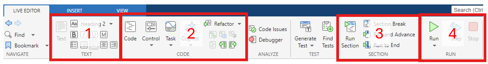](#TMP_68b5)
 
&emsp;&emsp;[Task 1: Create variable](#TMP_2f7d)
 
&emsp;&emsp;[Task 2: Math calculation + Call built\-in function](#TMP_22e2)
 
&emsp;&emsp;[Task 3: Live script and Live Task](#TMP_633a)
 
&emsp;[Introduction to Simulink](#TMP_7508)
 
&emsp;&emsp;[Simulink](#TMP_3c78)
 
&emsp;&emsp;[Task 4: Simulink block and Simulation](#TMP_038e)
 
&emsp;&emsp;[Task 5: Math calculation](#TMP_6847)
 
&emsp;&emsp;[Task 6: Dashboard control](#TMP_1a7c)
 
&emsp;[Simulink with Embedded system \[Arduino\]](#TMP_368e)
 
&emsp;&emsp;[Task 7: Arduino Hardware support](#TMP_64b6)
 
&emsp;&emsp;&emsp;[Digital Output](#TMP_3d03)
 
&emsp;&emsp;&emsp;[Tachometer](#TMP_9f9f)
 
&emsp;&emsp;&emsp;[PWM](#TMP_17b8)
 
&emsp;&emsp;[Task 8: Test pattern with Signal Editor and Collect data](#TMP_0889)
 
&emsp;&emsp;[Task 9: PID control](#TMP_2cd0)
 
&emsp;[\[Optional\] Create Plant modelling](#TMP_9d6c)
 
&emsp;&emsp;[Task 10: \[Optional\] Data Clean up and Preprocessing](#TMP_6e74)
 
&emsp;&emsp;[Task 11: \[Optional\] System Identification](#TMP_88c8)
 
&emsp;&emsp;&emsp;[Load data](#TMP_07bf)
 
&emsp;&emsp;&emsp;[Preprocess data](#TMP_0191)
 
&emsp;&emsp;&emsp;[Estimate and Validate](#TMP_6a57)
 
&emsp;&emsp;&emsp;[Apply model for simulation](#TMP_722f)
 
&emsp;[Simulation close loop Control Tunning with virtual plant \[PID Tuner\]](#TMP_78e0)
 
&emsp;&emsp;[Task 11: Virtual plant close loop control](#TMP_2892)
 
&emsp;&emsp;[Task 12: Tunning Controller with PID tunner](#TMP_7513)
 
<!-- End Toc -->
<a id="TMP_7da6"></a>

# Prerequisite checking
<a id="TMP_1032"></a>

## Hardware & Software

 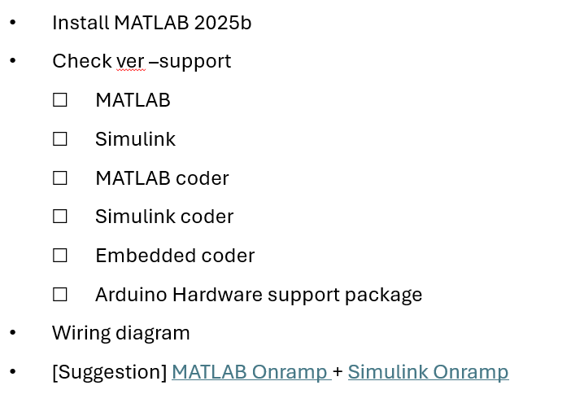

<a id="TMP_9b79"></a>

## Instruction files: 

 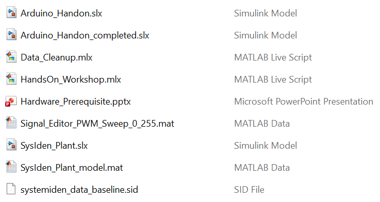

<a id="TMP_2f17"></a>

## Wiring Diagram


<a id="TMP_7fc6"></a>

# Introduction to MATLAB

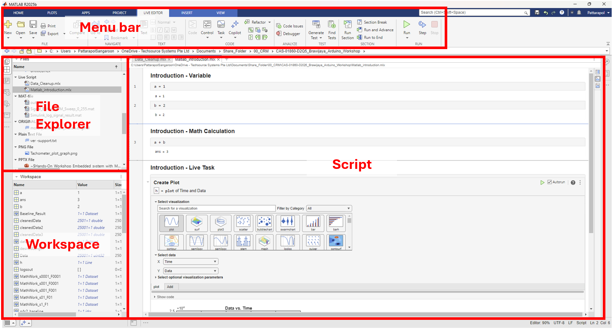

<a id="TMP_7f2a"></a>

## Menu bar
<a id="TMP_68b5"></a>

1.  **TEXT \-** Text editor tools ex. Style, Bold, Italic, Bullet
2. **CODE \-** Code editior tools ex. Code section, Control button, Live Task
3. **SECTION \-** Section editor tools ex.
4. **RUN \-** Run entire code, Step in\-out, Stop
<a id="TMP_2f7d"></a>

## Task 1: Create variable
-  Create 1st variable "a = 1" 
-  Create 2n variable "b = 2" 

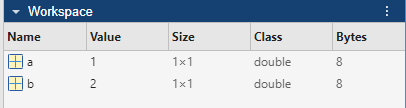

```matlab
a = 1
b = 2
```
<a id="TMP_22e2"></a>

## Task 2: Math calculation + Call built\-in function
-  Calculate "result = a + b" 

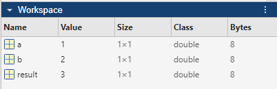

```matlab
result = a + b
```

-  Call function linspace "series = linspace(0,10, 5)" 

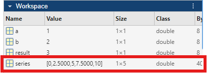

```matlab
series = linspace(0,10, 5)
```
<a id="TMP_633a"></a>

## Task 3: Live script and Live Task
-  Go to "Task" \-\-> "Create plot" 

 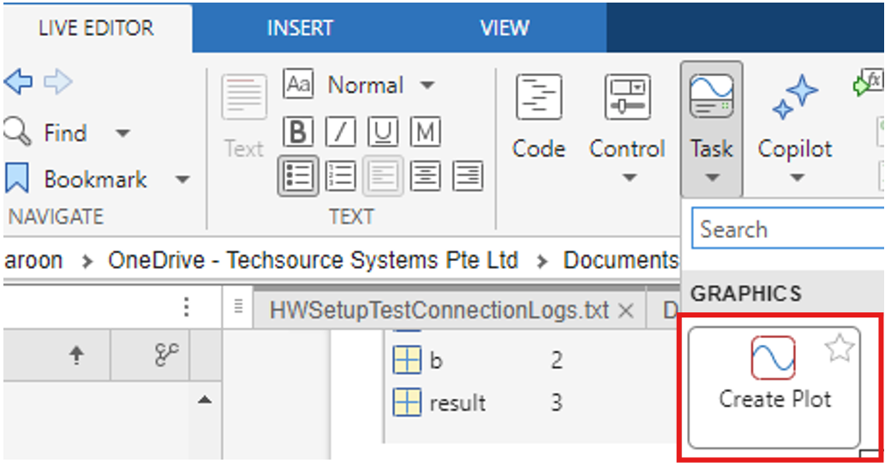

-  Select visualization "**Plot**" 
-  Select data "**Y = series**" 

 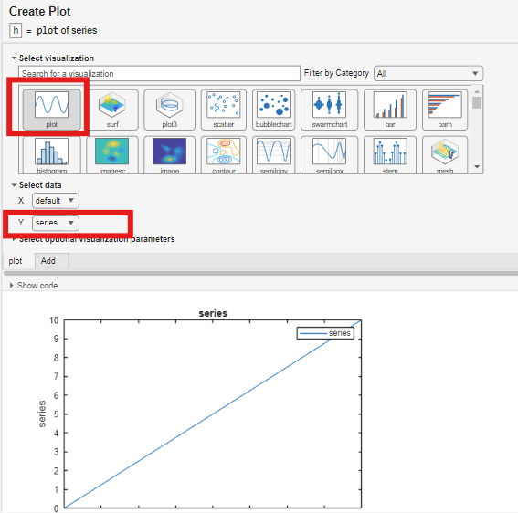

```matlab
% Create plot of series
h = plot(series,"DisplayName","series");

% Add ylabel, title, and legend
ylabel("series")
title("series")
legend
```
<a id="TMP_7508"></a>

# Introduction to Simulink
<a id="TMP_3c78"></a>

## Simulink

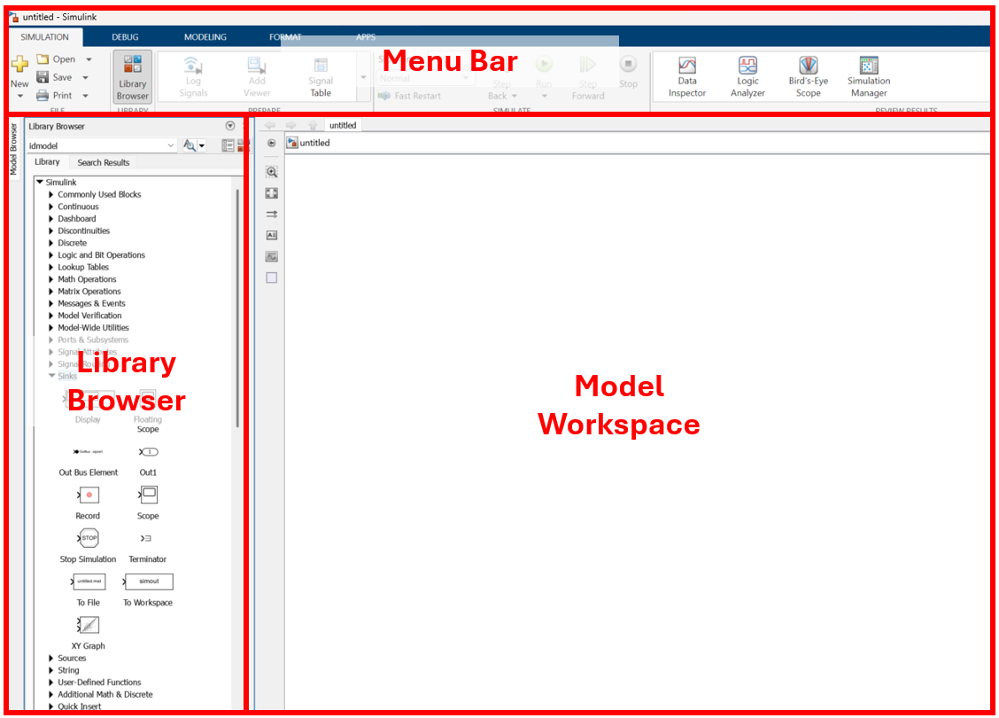

<a id="TMP_038e"></a>

## Task 4: Simulink block and Simulation
-  Drag and Drop "**Sine Wave**" block from "**Simulink>Sources**" to the workspace 
-  Drag and Drop "**Scope**" block from "**Simulink>Sink**" to the workspace 
-  Connect the signal from "**Sine Wave**" to "**Scope**"  

 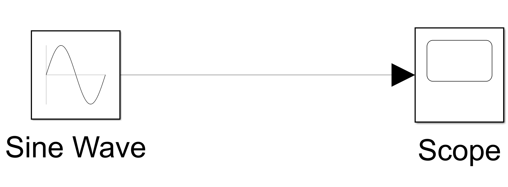

-  Start simulate the system by clicking "**Run**" at Simulate section 

 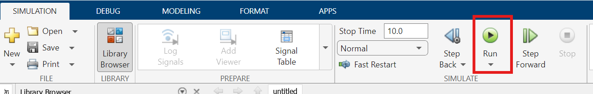

-  Check the output by double click at "**Scope**" 

 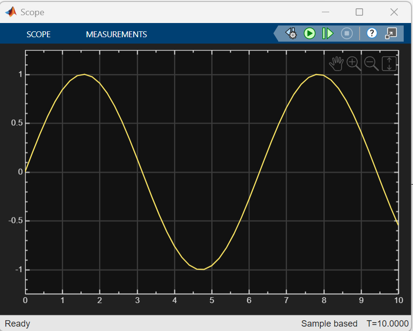

<a id="TMP_6847"></a>

## Task 5: Math calculation
-  Drag and Drop "**Gain**" block from "**Simulink>Math Operations**" to the workspace 
-  Place the "**Gain**" block in the signal line between "**Sine Wave**" and "**Scope**" block  

 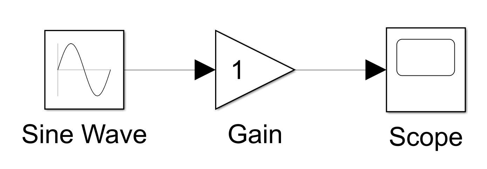

-  Double click at "Gain" block and Change the gain value to 2 

 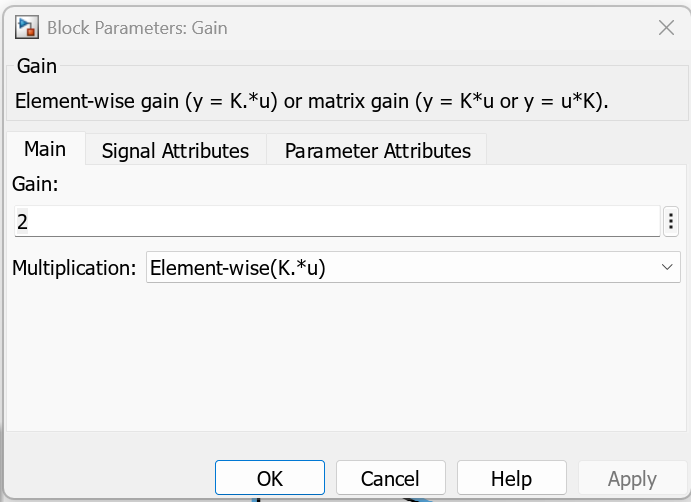

-  Start simulate the system by clicking "**Run**" at Simulate section 
-  Check the output by double click at "**Scope**" 

 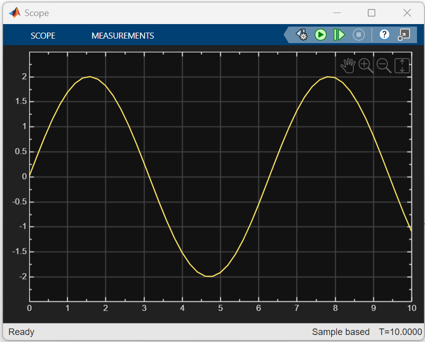

<a id="TMP_1a7c"></a>

## Task 6: Dashboard control
-  Drag and Drop "**Slider**" block from "**Simulink>Dashboard**" to the workspace 

 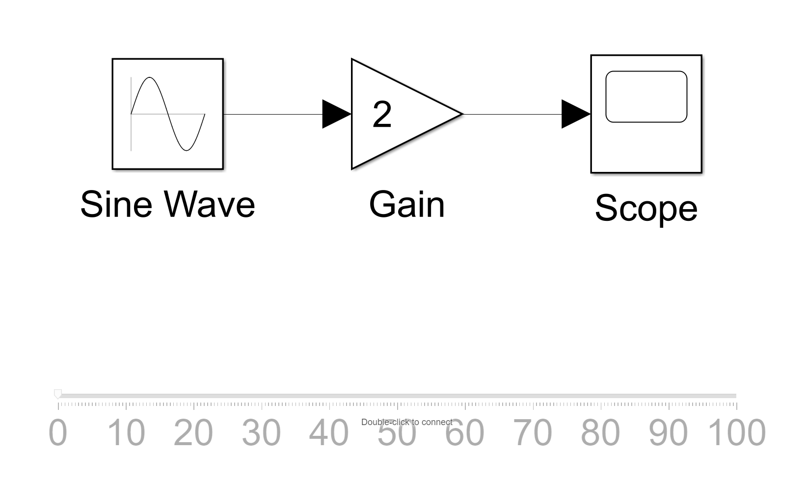 

-  Double click at "**Slider**" \-\-> Select "**Gain**" block \-\-> Click at "**Connect**" check of the gain value \-\-> Click "**OK**" to confirm 

 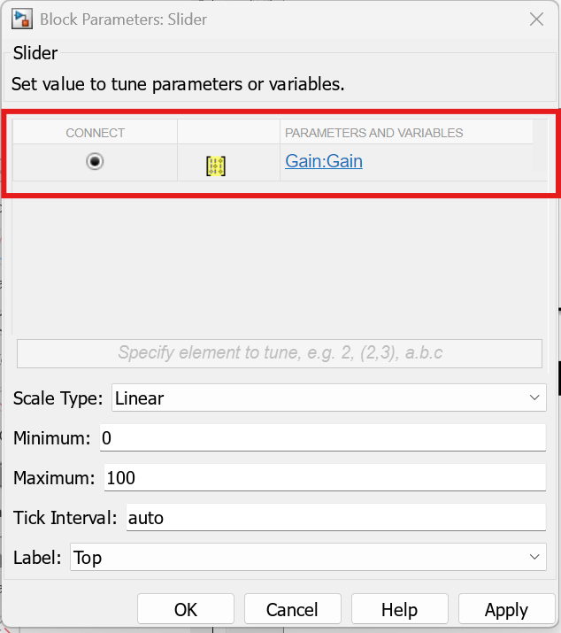

-  Change "**Stop Time**" to "**Inf**" 

 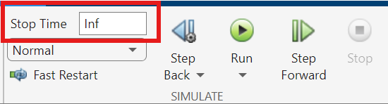

-  Try to Slide the "**Slider**" bar and see the changed of Sine Wave at "**Scope**" 

 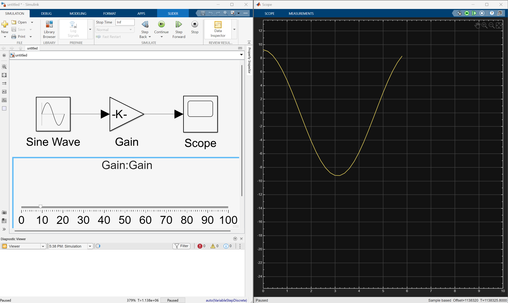

<a id="TMP_368e"></a>

# Simulink with Embedded system \[Arduino\]

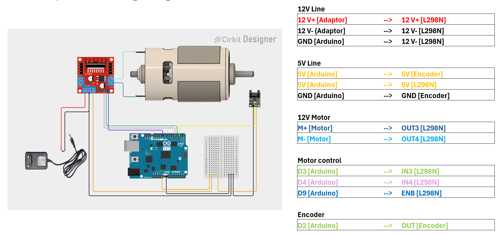


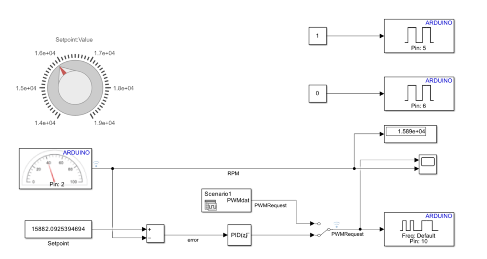

<a id="TMP_64b6"></a>

## Task 7: Arduino Hardware support

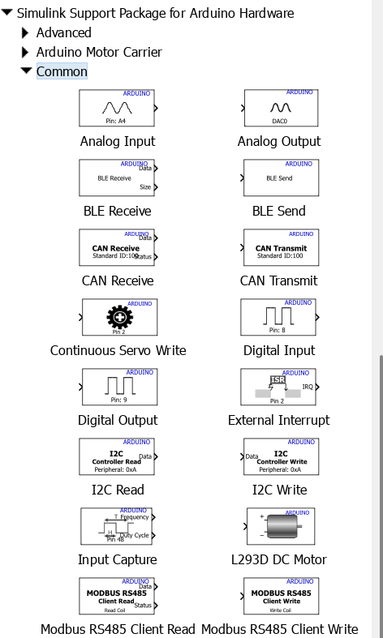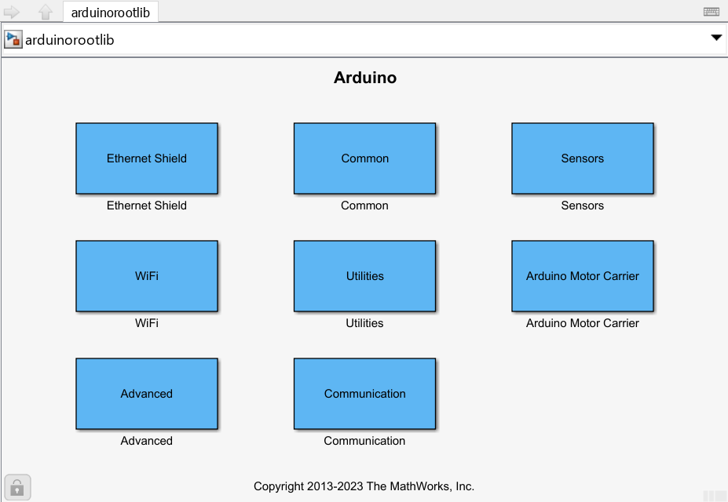

<a id="TMP_3d03"></a>

### Digital Output
-  Drag and Drop "**Digital Output**" 2 blocks from "**Simulink>Simulink Support Package for Arduino Hardware>Common**" to the workspace 
-  \-\-> Set output pin of "**Digital Output**" to 3 and 4 respectively \-\-> Create "**Constant**" block value "**0**" and "**1**" and sending to those "**Digital Output**" respectively 

 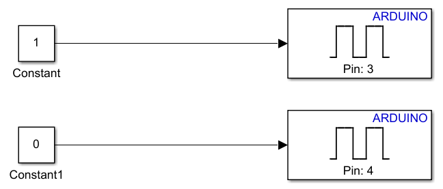

<a id="TMP_9f9f"></a>

### Tachometer
-  Drag and Drop "**Tachometer**" 2 blocks from "**Simulink>Simulink Support Package for Arduino Hardware>Sensors**" to the workspace 
-  \-\-> Set "Pulse count per rotation" to "**20**" and "Sample time" to "**0.01**" connect the output to "**Scope**" and "**Display**" block 

 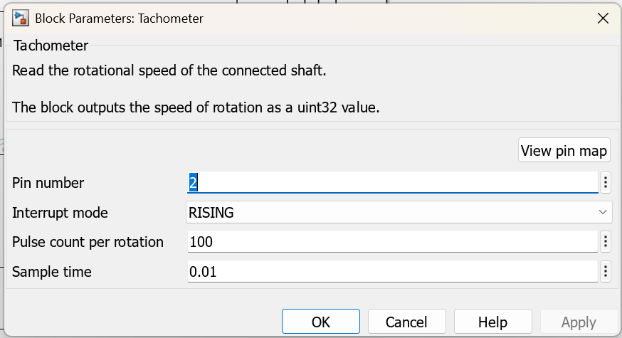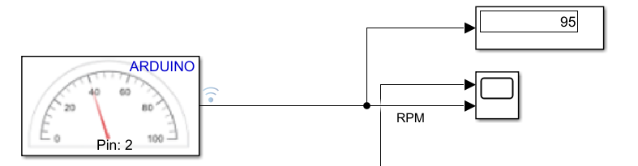

<a id="TMP_17b8"></a>

### PWM
-  Drag and Drop "**PWM**" blocks from "**Simulink>Simulink Support Package for Arduino Hardware>Common**" to the workspace 
-  \-\-> Set "**Pin number**" to "**9**" and Create constant value "**150**" to be the input for "**PWM**" block 
-  Route signal from constant to be the another input to "**Scope**" to see the output comparison between "**PWMRequest**" and "**RPM**" 

 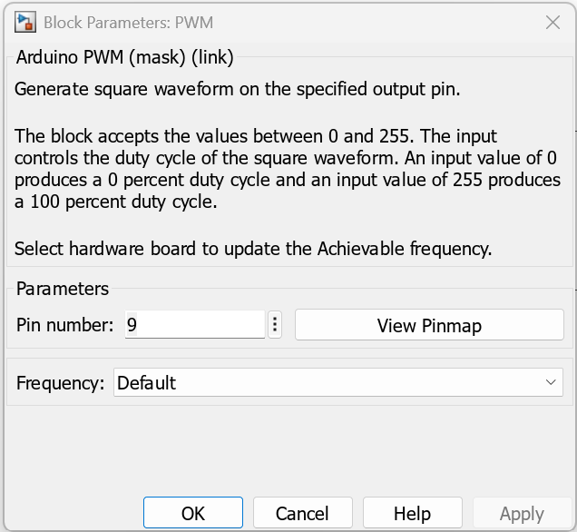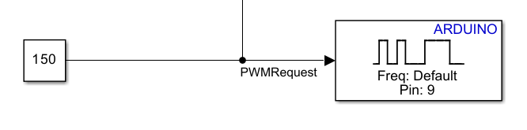

-  Start simulate the system by clicking "**Run**" at Simulate section 
-  Check the output by double click at "**Scope**" 

 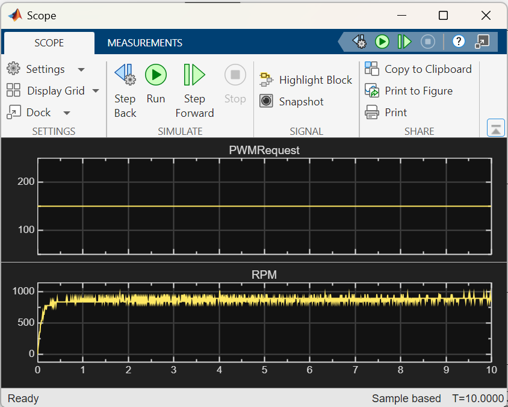

<a id="TMP_0889"></a>

## Task 8: Test pattern with Signal Editor and Collect data
-  Drag and Drop "**Signal Editor**" block from "**Simulink>Source**" to the workspace 
-  Drag and Drop "**Manual Switch**" block from "**Simulink>Signal Routing**" to the workspace 
-  Connect "**Signal Editor**" and Previous PWM's "**Constant**" to "**Manual Switch**" \-\-> Connect output of "**Manual Switch**" to be the input of "**PWM**" block from previous task 

 

-  Edit paramter in "**Signal Editor**" 
-  Set "**File name**" to the provided file "**Signal\_Editor\_PWM\_Sweep\_0\_255.mat**"  and "**Active Scenario**" to "**Scenario 1**"    

&nbsp;&nbsp;&nbsp;&nbsp;&nbsp;&nbsp;&nbsp;&nbsp; \*You can view the test pattern by clicking the icon in Blue square which will open the Signal Editor window that allow you to view, modify and create any signal pattern


 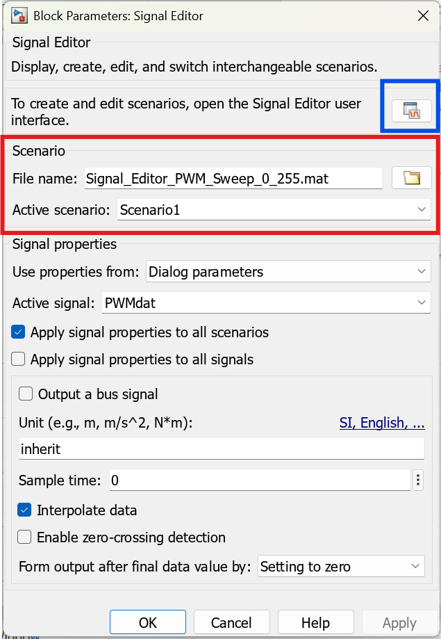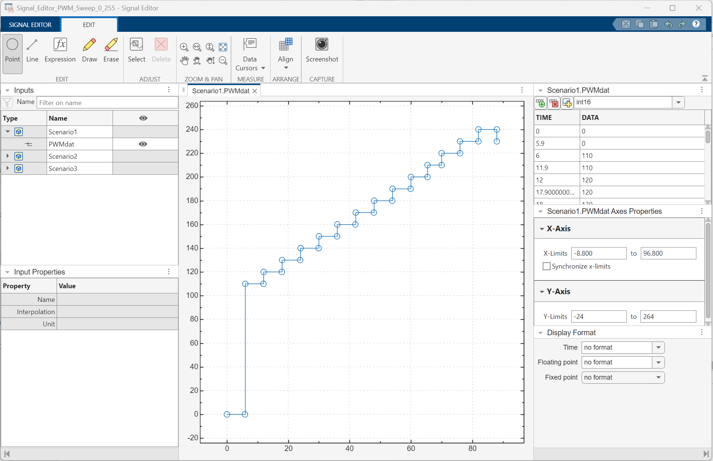

-  Log the Signal using "**Log Signals**" function by highlight "**PWMRequest**" and "**RPM**" signal \-\-> Go to Signal Tab \-\-> Check "**Log Signal**" *\*This action will all the system to log the data and enable use to view the data in "****Data Inspector****"* 
-  Start simulate the system by clicking "**Run**" at Simulate section 
-  Check the output by double clicking at "**Scope**" 
-  Check the logged output by clicking at "**Data Inspector**"  

 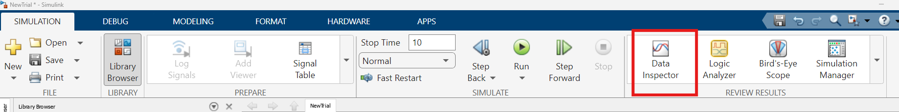


 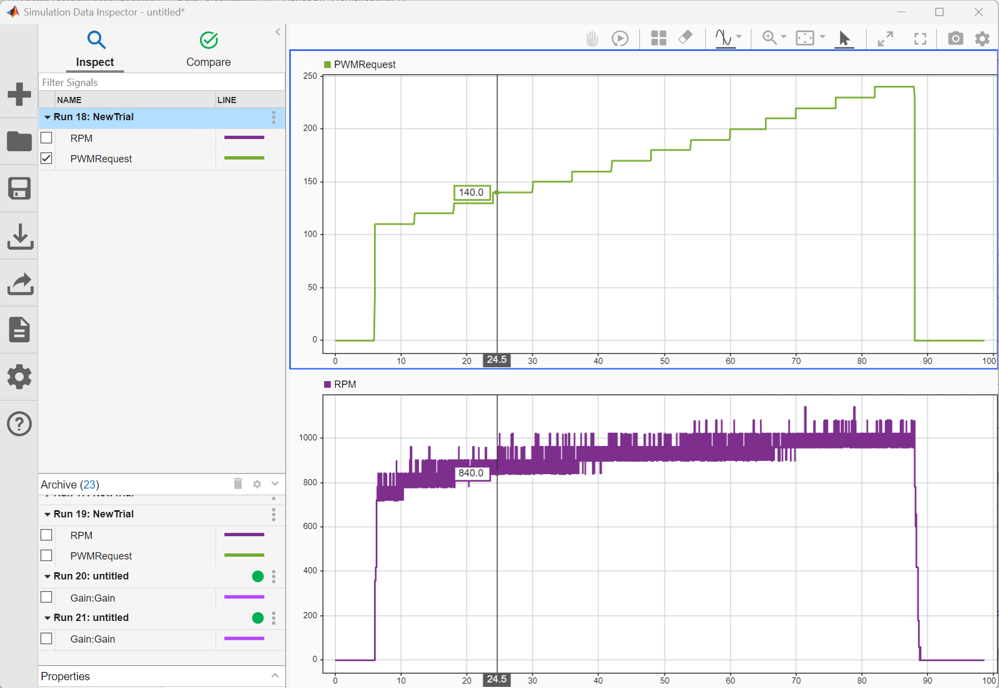

-  Export the log result by Highlight signals data and Right click \-\-> Export \-\-> Base workspace *\*The result will be exported to MATLAB workspace ready for next process*  

 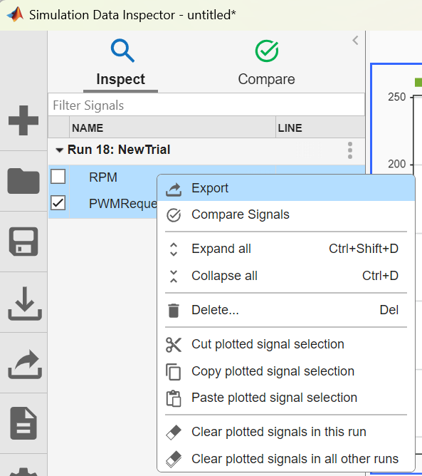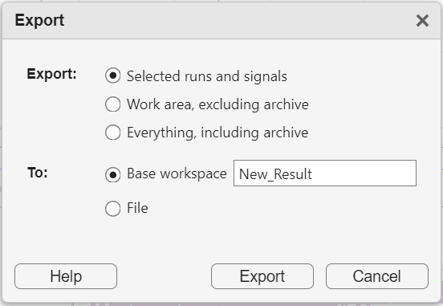

<a id="TMP_2cd0"></a>

## Task 9: PID control
-  Drag and Drop "**Discrete PID Controller**" block from "**Simulink>Discrete**" to the workspace \-\-> Connect to the "**Manual Switch**" in place of PWM "**Constant block**" 
-  Drag and Drop "**Subtract**" block from "**Simulink>Math Operations**" to the workspace \-\-> Connect to the input of "**Discrete PID Controller**" 
-  Create "**Constant**" to be the setpoint for PID controller subtract by RPM reading from "**RPM**" by using "**Subtract**" block 
-  Drag and Drop "**Knob**" block from "**Simulink>Dashboard**" to the workspace \-\-> Connect to setpoint's "**Constant**" block *\*This enable us to change the target setpoint during simulation* 

 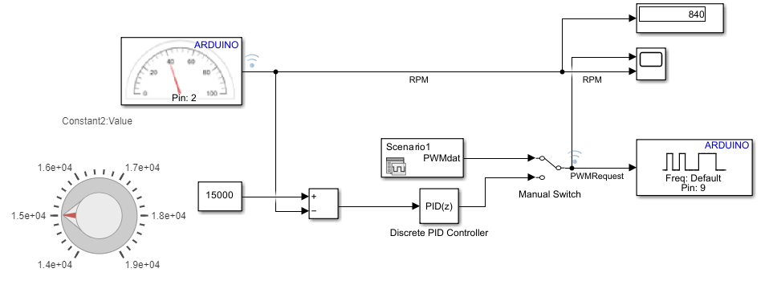

-  Start simulate the system by clicking "**Run**" at Simulate section *\*Try to change the setpoint by varying knob during the simulation to see the response* 
-  Check the output by double clicking at "**Scope**" 
-  Check the logged output by clicking at "**Data Inspector**" 
```matlab
open Arduino_Handon.slx
```
<a id="TMP_9d6c"></a>

# \[Optional\] Create Plant modelling 
<a id="TMP_6e74"></a>

## Task 10: \[Optional\] Data Clean up and Preprocessing

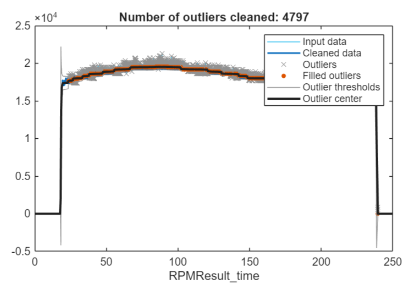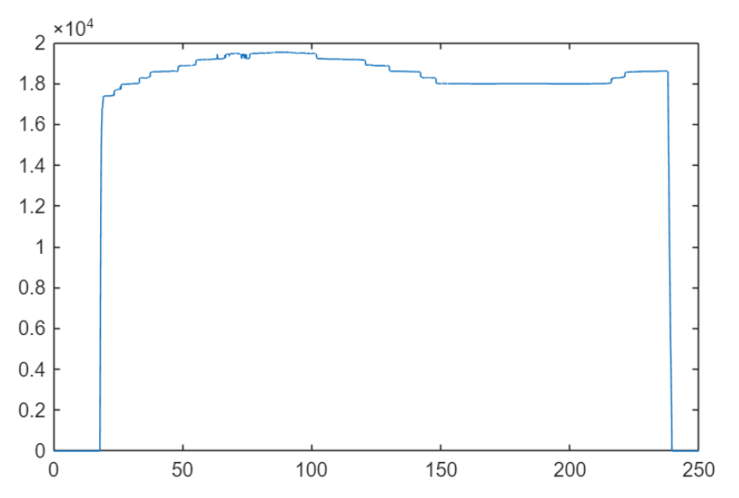

```matlab
load Baseline_Result.mat
open Data_Cleanup.mlx
```

```matlab
plot(RPMResult_time,PWMRequest_Resam_100Hz)
title("Input (PWM)")
plot(RPMResult_time,RPMResult_Clean_func)
title("Output (RPM)")
```
<a id="TMP_88c8"></a>

## Task 11: \[Optional\] System Identification
-  Open "systemIdentification" 
```matlab
systemIdentification
```
<a id="TMP_07bf"></a>

### Load data
-  Load "Time domain data" by using "PWMRequest\_Resam\_100Hz" and "RPMResult\_Clean\_func" as an "input" and "output" respectively. 
<a id="TMP_0191"></a>

### Preprocess data
-  "**Select Range**" for Select only operating range *\*select sample \[2151 23651\] \- exclude PWM = 0 region* 
-  "**Remove means**" for removing overall mean 
-  "**Select Range**" for Separating data for "**estimation\[1:6341\]**"  and "**validation\[6340:13308\]**"  
<a id="TMP_6a57"></a>

### Estimate and Validate
-  "**Quick Start**" for quick estimate the model by default method (Imp, Freq, ARX, state space) 

 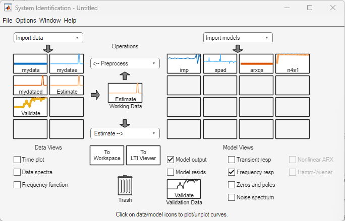

-  Check "**Model ouput**" to compare the result with the "**validation data**" 

 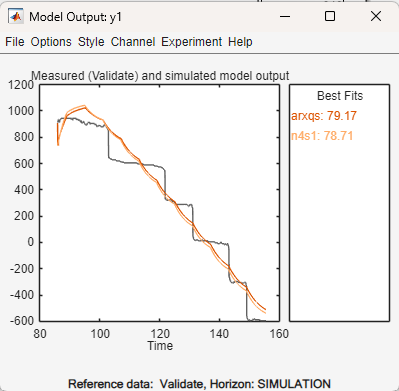

-  Double click at model and "**Export**" the model \-\-> Model will appear in MATLAB workspace. 
<a id="TMP_722f"></a>

### Apply model for simulation
-  Review predefine session model "**systemiden\_data\_baseline**" 
```matlab
systemIdentification("systemiden_data_baseline")
```

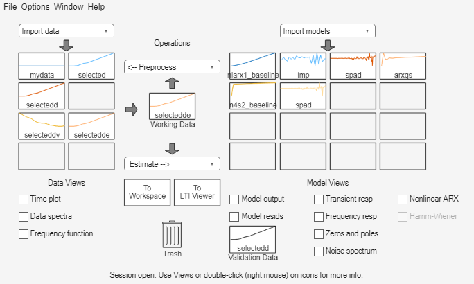

-  Load predefine model data 
```matlab
load SysIden_Plant_model.mat
```

-  Open predefine plant 

 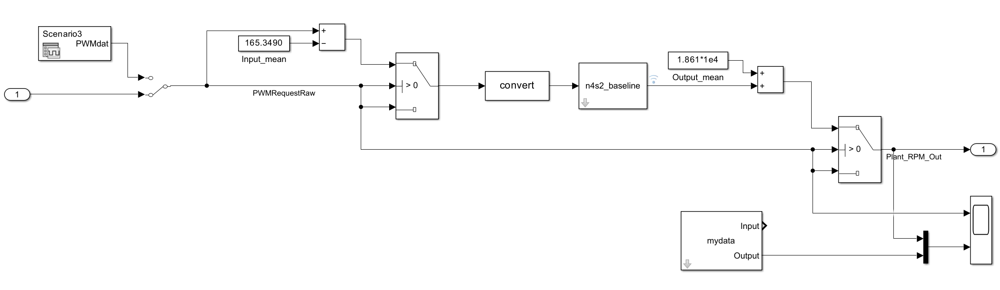

```matlab
open SysIden_Plant.slx
```

```matlab
sim("SysIden_Plant.slx", 250)
```

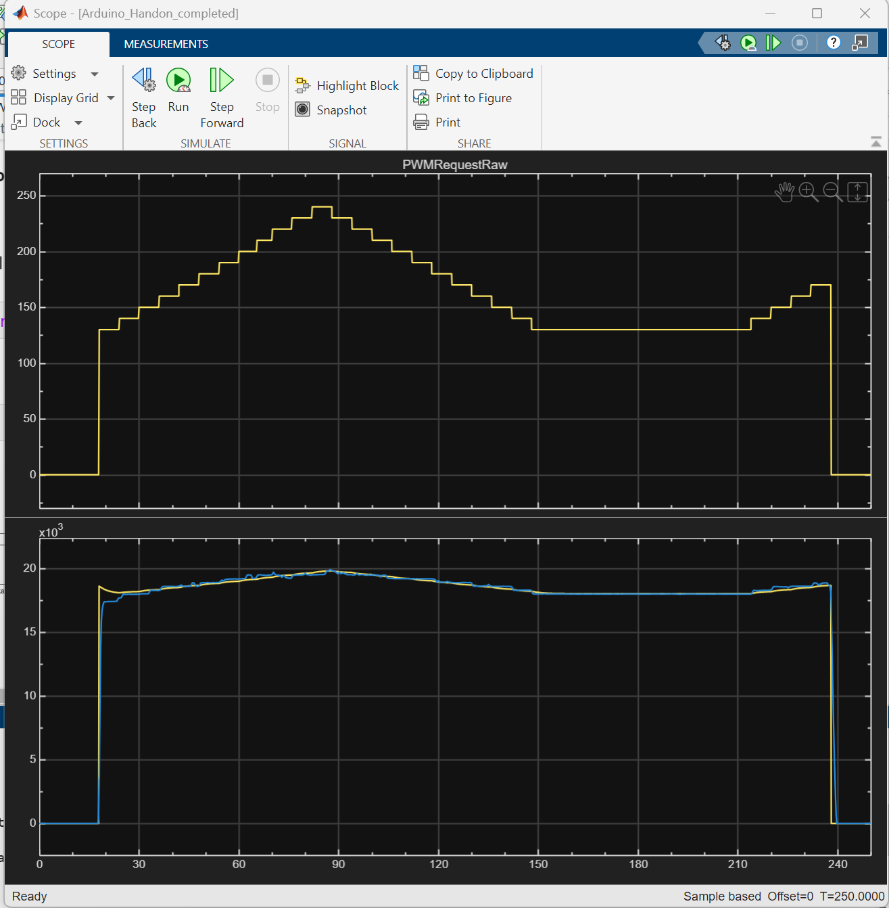

<a id="TMP_78e0"></a>

# Simulation close loop Control Tunning with virtual plant \[PID Tuner\]
<a id="TMP_2892"></a>

## Task 11: Virtual plant close loop control
-  Drag and Drop "**Model**" block from "**Simulink>Ports & Subsystems**" to the workspace 
-  Double click at "Model" block and link to "SysIden\_Plant.slx" 

 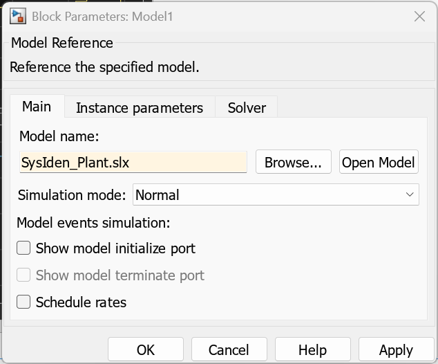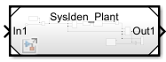

-  Connect "**PWMRequest**" to the Plant's "**model**" and Loop back Plant's model output to PID process. *\*Do not forget to add "****Unit Delay****" in simulation* 
-  You can add another "**Manual Switch**" for easier switching between "**RPM"** input from "**Tachometer**" or "**Plant's model**" block 

 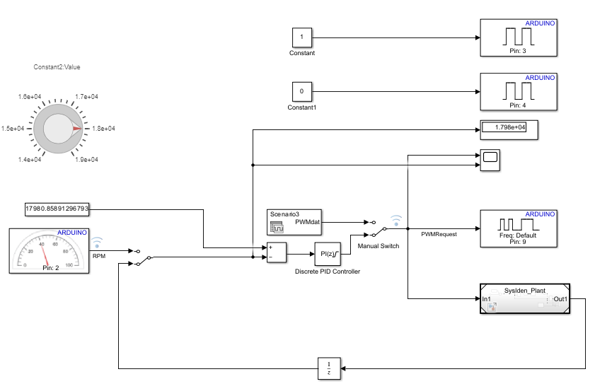

-  Start simulate the system by clicking "**Run**" at Simulate section *\*Try to change the setpoint by varying knob during the simulation to see the response* 
-  Check the output by double clicking at "**Scope**" 

 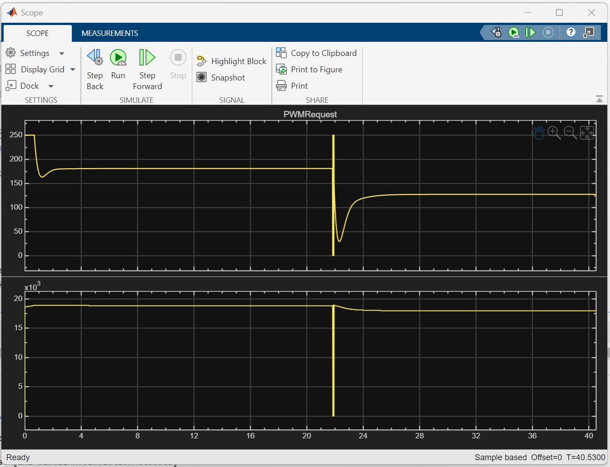

<a id="TMP_7513"></a>

## Task 12: Tunning Controller with PID tunner
-  Double click at "**Discrete PID Controller**" \-\-> Click "**Tune**" button 

 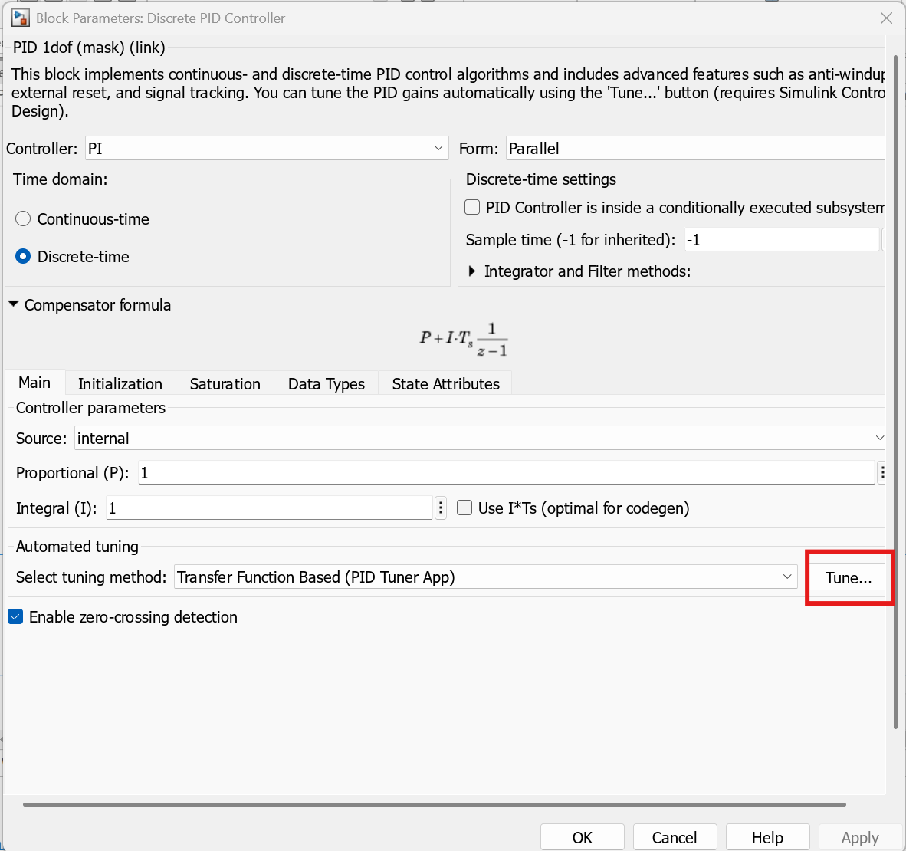

-  PID tuner window will pop\-up. You can try to tune your controller's "**Response time**" and "**Transient Behavior**" by sliding the bar in picture below \-\-> Click "**Update Block**" after you finished 

 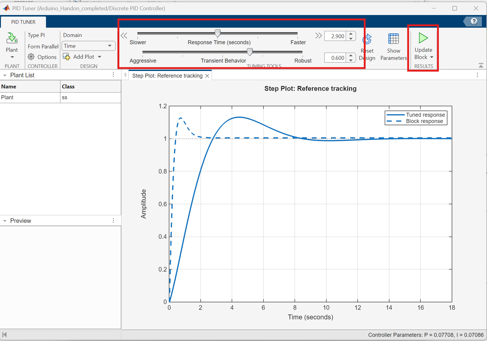

-  Try to "**Run**" simulation again to see the chage after you tunning 

 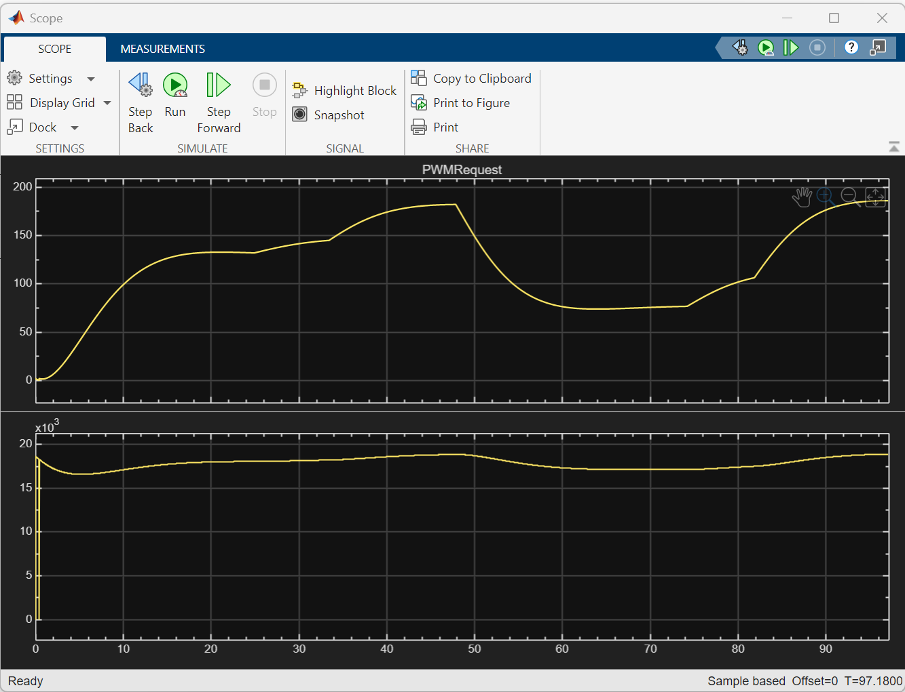

```matlab
open Arduino_Handon_completed.slx
```
